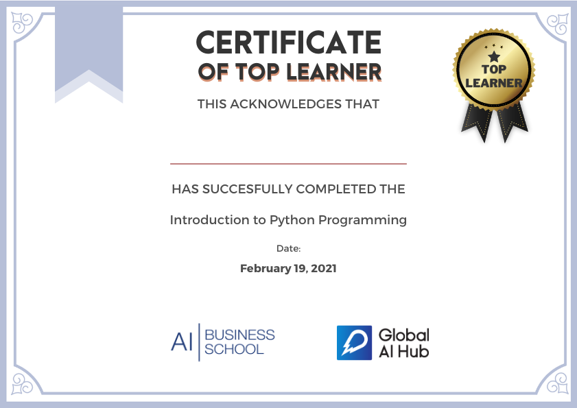

# GAIH Student Repo


**Course Date:** 05/04/2021-09/04/2021<br/>
**Name:** Burak  <br/>
**Surname:** Topçu  <br/>
**Email:** brktopcu@gmail.com  <br/>

**Note:** 
File Explanations: Homeworks and project folders contains .ipny and .py files which created with Jupyter Notebook.
But if you want to run my scripts on any Python Shell or Prompt, I edited and uploaded .py files with name suffix (Executable),
because **input()** function not callable at many situation in shell and causing error,need to use 	**raw_input()** function instead of input().
## Final Project

I created "Knowledge Competition" program, which includes questions for measure your
general knowledge on recent history of cinema (popular actress,movies,directors at last years etc.)
I used nested lists and nested dictionary in project,also created and used custom functions.

## Requirements
```
My works no require any additional library.
```
---

### Certification


